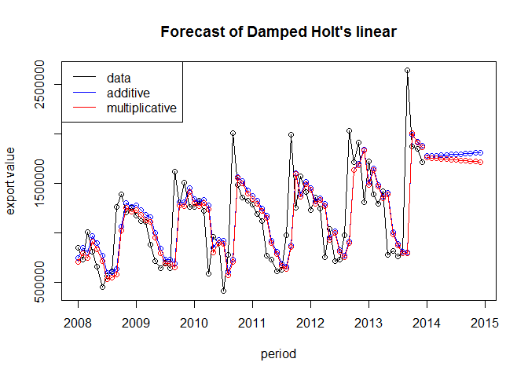
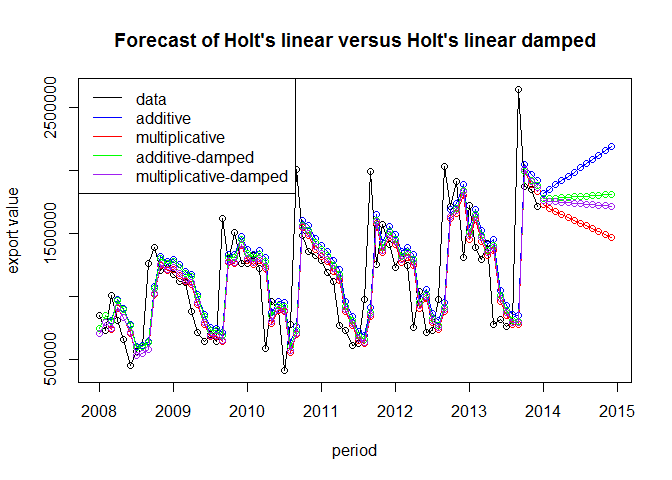

# Unit 10: Chulwalar Economic Study
Alex Deshowitz  
July 17, 2016  


# Introduction
##### We have been asked with assessing the economic data for the country of Chulwalar and providing a forecast for the main exports of Chulwalar: Red Etel, Blue Etel, Wuge, and Efak.  We will first focus on picking an export to forecast and will be able to apply the same methodology later to forecast the remaining exports.

# Data cleaning and Preparation
##### **Overview**: We were given 3 semicolon delimited files for this study to complete our work.  The files contained actual (as-is) data, planned data, and economic indicators for Chulwalar.  The code that is sourced below can be found in the "analysis " folder of this project.  The file uses the packages reshape, reshape2, tidyr, and gdata to reformat the data that we were given into nice clean datasets that the user can use for analysis.  We also sorted the data and added in a month number column for reference.

##### If you follow along, please ensure that your working directory is set and that your file structure is appropriate.  Additionally, you can copy this repo off of github.

* Source the "data_cleaning.R"" file


```r
source("analysis/data_cleaning.R")
```


* Next, we needed to import and create time series for all of the data files from the clean files.  The source code below runs a file called "data_cleaning_time_series.R"


```r
source("analysis/data_cleaning_time_series.R")
```


# Exploratory Data Analysis  (EDA)

##### **Overview** : For this section, we will show some of the code, because it does help in the understanding of what steps were used in the create the analysis.  


### EDA: basic graphs

* First, I want to look at the data, because I have not selected the variable that I want to model yet.  This might help me decide

<!-- -->

##### Based on this graph, we can see that:
* The data overall appear to be seasonal
* Blue etel seems to be more volatile than red, but also exports alot less
* We can hypothesize that the multiplicative model may make sense since visually some of these variables seem to be experiencing larger swings in seasonality over time.

##### I also want to look at the data on an annual basis

<!-- -->

##### The blue etel catches my attention on an annual basis as we see a large dip.  Could there have been a bad crop?  Disease?  It does look like the demand has recovered and grown really nicely.  We would not have necessarily seen this on a monthly level.

##### Now, Let's take a look at the data for the latest full year of availability (2013) to see how they stack up relative to eachother.

<!-- -->

##### It is evident that etel, driven by the red variety is the largest export for Chulwalar.  Etel is followed by Efak, and Wuge in order

##### Due to the Economy's high reliance on red etel I have decided to forecast this export. I will now focus on the relationship of red_etel with other variables

#####The next steps in the EDA focus on decomposing the time series using 2 methods and comparing the red etel to the plan data.

### EDA: Decomposition using both classical and STL methods

* In the following lines, I will decompose the red etel using both the classical method and the STL method
* This approach will help us decompose the data into seasonal, trend, and random components

#### Classical decomposition

* We first created the decomposed variable

```r
cl_fit_red_etel_as_is <- decompose(red_etel_as_is)
```
<!-- -->

##### As stated before, it looks like the trend of red etel trend is increasing over time and that there is definitely a strong seasonal component to the data.  The random component looks random and does not show a trend.

##### Let's see what red etel looks like seasonally adjusted

<!-- -->

##### We can definitely see that the seasonality is taken out and that the random component is strong in the trend


#### STL decomposition

<!-- -->

##### This one seems to make a little more sense, plus we get the benefit of having more periods involved in the decomposition
##### In this model, it does look like the random may be getting slightly higher over time.

<!-- -->

##### The trend component here looks reasonable on the main data and seems to capture the overall direction quite well.

<!-- -->

##### The monthplot shows us 12 unique lines that highlight the average seasonality for all years by month in the datasets
##### This particular plot shows us that September is overall the seasonal high for red etel with a decent amount of dispersion over time.  We also see that many months show a declining seasonal trend over time.  In particular, the Spring and Summer months show declines while the winter months seem to be increasing or staying the same.

##### Overall, we can see that the Red etel has an upward trend trajectory and a strong seasonal component.  This information leads us to believe that a Holt Winters seasonal model will be best for this forecast.


### EDA: Plan versus As is data

* In the following lines, we will test the correlation and then the accuracy of the plan for each category.

#### Correlation between As Is and Plan Data

We will test the correlation between As Is and Plan data in order to test how well plan tracks to actual . Correlation is a measure of the strength of linear relationship between two variables. It can be viewed as a measure of how well 2 variables move together.

```r
cor(red_etel_as_is , red_etel_plan)
```

```
## [1] 0.9106702
```

* We can see that red etel is very highly correlated with the plan data.  However, this just means that they move together.  We cannot see the difference in the variables in this view.

#### Red etel Plan versus actual accuracy


<!-- -->

```
##                 ME     RMSE      MAE       MPE    MAPE        ACF1
## Test set -25220.58 184229.4 140468.1 -5.328066 13.5683 -0.07461207
##          Theil.s.U
## Test set 0.3975167
```

##### Red etel has a MAPE of 13.6% and a mean percentage error of -5.32%.  There is obviously alot of volatility in the plan.
##### I know that the correlation between the two is high, but I am more interested in the plan accuracy.  
##### In the graph, we can see that the two do move together, but the accuracy measures show us that the average gap can fluctuate and potentially lead us to have planning error.


### EDA: Correlation with economic indicators


####The indicators are as follows:

* Monthly Change in Export Price Index (Export Prices)
* Monthly Satisfaction Index (SI) government based data
* Average monthly temperatures in Chulwalar
* Monthly births in Chulwalar
* Monthly Satisfaction Index (SI) external index 
* Yearly Exports from Urbano
* Yearly number of Globalisation Party members in Chulwalar
* Monthly Average Export Price Index for Chulwalar
* Monthly Producer Price Index (PPI) for Etel in Chulwalar
* National Holidays
* Chulwalar Index (Total value of all companies in Chulwalar)
* Monthly Inflation rate in Chulwalar
*	Proposed spending for National Holidays
* Influence of National Holiday

##### Please note that all of the indicators have been converted to TS in the preceeeding source code

##### **Export Prices**

```r
par(mfrow = c (1, 1))

plot(chg_in_export_prices, main="Change in export prices")
```

<!-- -->

```r
cor(red_etel_as_is , chg_in_export_prices)
```

```
## [1] 0.3587646
```

##### While there is a positive correlation (r = .36), the relationship is not very strong

##### **Government Satisfaction Index**


```r
par(mfrow = c (1, 1))
plot(satisfaction_index_gov, main="govt satisfaction index")
```

<!-- -->

```r
cor(red_etel_as_is , satisfaction_index_gov)
```

```
## [1] 0.009978415
```

#####  There is basically no relationsip between red etel and the government sponsored satisfaction index ( R = 0.001)

##### **Temperature**


```r
par(mfrow = c (1, 1))
plot(average_temperature, main="average temperature")
```

<!-- -->

```r
cor(red_etel_as_is , average_temperature)
```

```
## [1] -0.4028941
```

##### The relationship between red etel and temperature is negative ( when temperatures rise, demand declines).  However, the relationship is not strong (r = 0.4)

##### **Births**


```r
plot(births, main = "monthly births in chulwalar")
```

<!-- -->

```r
cor(red_etel_as_is , births)
```

```
## [1] -0.1217222
```

##### The relationship with births is negative but not strong (r = -0.12)

##### **Satisfaction Index- External**


```r
plot(satisfaction_index_indep, main = "independent satisfaction index")
```

<!-- -->

```r
cor(red_etel_as_is , satisfaction_index_indep)
```

```
## [1] 0.2960946
```

##### While the relationship between efak and wuge was strong, red etel seems to be weak (R = 0.30)


#####  **Total Urbano Exports**


```r
plot(total_exports_from_urbano_ANNUAL, main = "Total Urbano exports")
```

<!-- -->

```r
cor(red_etel_as_is_ANNUAL , total_exports_from_urbano_ANNUAL)
```

```
## [1] 0.9074769
```
##### Finally, the relationship between total Urbano exports and red etel seems to be very strong (R = 0.90).  However, note that these are annual data


##### **Globalization Party Members**


```r
plot(globalisation_part_members_ANNUAL, main = "Globalization party members")
```

<!-- -->

```r
cor(red_etel_as_is_ANNUAL , globalisation_part_members_ANNUAL)
```

```
## [1] 0.8868788
```

##### Notice that we has to annualize the data here (done in the time series creation code).  Otherwise, we would get a stairstepped graph that could hide the trends.
##### We see a high correlation between the variables here (R = 0.89).   However, the data being annual could positively impact these results and skew the data.  It is interesting though.  Perhaps as exports increase (red etel being the largest) the globalisation party members increase.Could one be a leading indicator?

##### **Monthly Average Export Price Index**


```r
plot(average_export_price, main = "Average export prices")
```

<!-- -->

```r
cor(red_etel_as_is , average_export_price)
```

```
## [1] 0.3157277
```


##### The overall trend has been upward since mid-2009
##### However, the correlation with Red etel is weak (R = 0.32)

##### **ETEL production price index**


```r
plot(etel_productions_price_index, main = "Etel production price index")
```

<!-- -->

```r
cor(red_etel_as_is , etel_productions_price_index)
```

```
## [1] 0.3391872
```
##### Costs seem to have gotten pretty high over the past couple of years.  I wonder if this has hit blue etel more than red etel since blue has the weaker trend.  We would think that rising costs might be impacting the amount of etel being produced as those costs would be passed on  to the consumer thus decreasing demand.  That being said, demand can outstrip cost easily if the product sees a shift in demand due to something such as changes in tastes and preferences.

##### Etel doesnt seem to be correlated very highly (blue or red) (r = 0.34) with the ETEL production price index.


##### **Chulwalar index**


```r
plot(chulwalar_index, main = "Chulwalar index")
```

<!-- -->

```r
cor(red_etel_as_is , chulwalar_index)
```

```
## [1] 0.2242922
```

##### We do not have alot of metadata about this variable, but it has a similar trend to the independent sentiment survey.
##### No strong relationship here (R = 0.22).

##### **Inflation**


```r
plot(inflation, main = "Inflation")
```

<!-- -->

```r
cor(red_etel_as_is , inflation)
```

```
## [1] -0.0982151
```

##### Inflation was relatively high in 2008 for the period plotted but dropped about the time that we saw a drop in sentiment in the previous data.  It is looking like we may have something like a recession here.  I am apprehensive about saying this was a recession.  We do not know if this is a small part of a larger trend.  However, negative inflation is not something that we see in a robust economy.
##### Amazingly, there is virtually no impact to red etel exports as inflation has increased.  Inflation and Red Etel exports do not appear to be correlated (R = -0.09) 

##### **Spending for Chulwalar Days**


```r
plot(spending_for_chul_days_ANNUAL, main = "Chulwalar day spending")
```

<!-- -->

```r
cor(red_etel_as_is_ANNUAL , spending_for_chul_days_ANNUAL)
```

```
## [1] 0.7900434
```

##### It is funny that when it looked like we were seeing some declines in sentiment, that spending on Chulwalar days went up.  I wonder if this was people's big splurge to feel good about the extrinsic factors impacting their lives.

##### We have a strong correlation between red etel and chulwalar day spending.  Perhaps exports overall go up to fund the spending?  We have to watch out, because this is another annual figure.  (R = 0.79)

##### **Chulwalar Days and influence**


```r
plot(infl_of_chul_days, col = "blue", main= "Influence of Chulwalar days")
lines(chul_days, col = "red")
```

<!-- -->

##### We just wanted to put these on a graph to (poorly) visualize when these days occur and what periods act as influence periods.

##### It looks like there may be some influence in the months preceeding the large holidays.  This is a good thing to know when looking at the data.


##### To summarize the economic indicator EDA, we found that the only variables that had strong relationships with red etel were annual figures.  There is some fear in drawing any major conclusions from this information, because there is not a lot of data supporting this relationship.  Additionally, we do not see a strong relationship on any monthly data.  Therefore, we might be hard pressed to believe that any relationship exists otherwise.


# Forecasting

In the next section, we will create several forecasts for comparison purposes and then compare that data back to the plan data.  We will use simple exponential smoothing (average) forecasts, Holt's linear trend, damped versions of Holt's linear trend, and Holt Winters Seasonal forecasts.


### Forecasting: Simple Exponential Smoothing

Exponential Smoothing uses past values to calculate a forecast. The strength with which each value influences the forecast is weakened with help of a smoothing parameter. Thus we are dealing with a weighted average, whose values fade out the longer ago they were in the past.

We will create 4 models for red etel ( r code shown for reference)


```r
red_etel_ses_1<- ses(red_etel_as_is, alpha = .2, initial = "simple", he = 12) # smoothing parameter = .2
red_etel_ses_2<- ses(red_etel_as_is, alpha = .6, initial = "simple", he = 12) # smoothing parameter = .6
red_etel_ses_3<- ses(red_etel_as_is, alpha = .8, initial = "simple", he = 12) # smoothing parameter = .8
red_etel_ses_4<- ses(red_etel_as_is, he = 12) # default
```

#####The four models are:

* 1: alpha = .2
* 2: alpha = .6
* 3: alpha = .8
* 4: default ( one run in DR.McGee's code)

<!-- -->

##### Visually, the smoothing parameter of 0.8 seems to be the best fit.  However, due to the smoothing method, we notice a lag in the line.
##### We also notice that these give a flat mean forecast for the next 12 periods.  This is probably not what we want.

##### We will check the forecast accuracy with the accuracy function since AIC and BIC do not seem to be available to confirm our observations


```
##                               ME     RMSE      MAE       MPE     MAPE
## red_etel_ses_1_accuracy 50365.64 427639.4 312678.0 -8.207545 29.92153
## red_etel_ses_2_accuracy 21313.37 413710.7 251806.4 -6.461857 22.82824
## red_etel_ses_3_accuracy 15475.52 416946.1 263240.6 -5.617008 23.20563
## red_etel_ses_4_accuracy 20001.51 413366.4 252927.7 -6.181153 22.74997
##                             MASE        ACF1
## red_etel_ses_1_accuracy 1.662336  0.37382596
## red_etel_ses_2_accuracy 1.338716  0.07478409
## red_etel_ses_3_accuracy 1.399505 -0.10367880
## red_etel_ses_4_accuracy 1.344677  0.03177791
```

##### Based on the forecast accuracy, it looks like model 3 (alpha 0.8) has the lowest Mean percentage error (-5.61%).  However, the default model (model 4) has the lowest MAPE.  This is sort of a toss up.  Models 2, 3, and 4 are all pretty close.  We would probably just go with model 4 since it is the simple default method.

### Forecasting: Holt's linear trend

#####Holt added to the model in order to forecast using trends as well. For this it is necessary to add a beta, which determines the trend. If neither alpha nor beta is stated, both parameters will be optimised using ets(). The trend is exponential if the intercepts(level) and the gradient (slope) are multiplied with eachother. The values are worse. As the Beta was very low in the optimisation, the forecast is very similar to the ses() model. 

##### We will also make 2 models( r code shown for refrence)

* 1: additive

* 2: multiplicative


```r
red_etel_holt_linear_1 <- holt(red_etel_as_is,h=12)
red_etel_holt_linear_2 <- holt(red_etel_as_is, exponential=TRUE,h=12)
```

<!-- -->

##### This one still shows the slight offset in the graph.  However, the data look very close.  While the additive seems to be more peaked and match the period-1 very well, the offset might make this model look worse from an accuracy perspective.  So our bet is that the multiplicative actually looks better in the accuracy data.

##### We notice that the forecasts move in completely different directions.  This does not make much sense from a practical perspective; however, the output speaks to the the structure of the different models.  


##### Check the accuracy of the holt's linear models


```
##                                        ME     RMSE      MAE        MPE
## red_etel_holt_linear_1_accuracy -29025.55 414153.4 272406.1 -11.045506
## red_etel_holt_linear_2_accuracy  46496.26 412920.0 246562.3  -3.455583
##                                     MAPE     MASE       ACF1
## red_etel_holt_linear_1_accuracy 25.39809 1.448233 0.02746142
## red_etel_holt_linear_2_accuracy 21.85969 1.310835 0.01176690
```

##### It looks like the multiplicative model has a better forecast accuracy than the additive in just about every category


##### We also want to look at AIC and BIC in this case


```
##   red_etel_linear_1_AIC red_etel_linear_2_AIC
## 1              2178.415              2216.513
```

```
##   red_etel_linear_1_BIC red_etel_linear_2_BIC
## 1              2187.521               2225.62
```

##### Of course, the AIC and BIC say the opposite.  It looks like the additive is better in this case.

##### Overall, I would pick the additive if I had to pick a linear trend, because the forecast for the multiplicative doesn't make a whole lot of sense.  Additionally, the accuracies are not different enough to cause alarm.

### Forecasting: Holt's linear trend- Damped

##### Next, we wanted to look at the impact that damping might have on our forecast. We will just add the samping effect to the previous 2 models (R code shown for reference)

* 3: additive

* 4: multiplicative


```r
red_etel_holt_linear_3 <- holt(red_etel_as_is, damped=TRUE,h=12)

red_etel_holt_linear_4 <- holt(red_etel_as_is, exponential=TRUE, damped=TRUE,h=12)
```

<!-- -->

##### Visually, the damped makes the forecast look more subdued, which is what we would expect.  The fit looks the same, because we have only damped the forecast; therefore, our accuracy measures based on past values should remain the same between model set 1,2 and model set 3, 4
##### Let's plot all models on the same graph

<!-- -->


##### This graph really shows the difference that the damped makes in the forecasts.  The dampening method really subdues the linear forecast.


### Forecasting: Holt Winters Seasonal Model

##### Holt and Winters have expanded Holt's model further to include the seasonality aspect. The parameter gamma, which is for smoothing the seasonality, was added to achieve this. The values are better than the models without seasonality. This is logical, since the data is strongly influenced by seasonality.  In the following model, none of the parameters are given so that they will be optimised automatically. There are two models: one using an additive error model method and one using a multiplicative error model. The additive model gives slightly better results than the multiplicative model.

##### Based on our review of the data in the EDA section, we know that our dataset is highly seasonal.  We were able to decompose the series to show the seasonal component.  We know that Holt Winters models seasonality quite well.  We will now apply that model in 2 forms: additive and multiplicative (R code shown for reference)

* 1: additive

* 2: multiplicative


```r
red_etel_holt_winters_1<- hw(red_etel_as_is, seasonal = "additive")
red_etel_holt_winters_2 <- hw(red_etel_as_is, seasonal = "multiplicative")
```
<!-- -->

##### This forecast looks to be the best that we have seen so far in our study.  The multiplicative seems to provide the better, more-peaked forecast.  However, the additive may have a slightly less volatile forecast in the non-peaked periods.

##### Let's look at the states of the model

<!-- -->

##### This looks very similar to the decompositions we have already viewed.  However, we can compare the additive (left) to the multiplicative (right).  We do notice a difference in the slope section of the models.  In the 2012-2014 time periods, the models show very different slopes.  We will need to check the forecast accuracy of these models to decide which is best.


```
##                                           ME     RMSE      MAE       MPE
## red_etel_holt_winters_1_accuracy -17228.4516 166083.2 129350.5 -4.111897
## red_etel_holt_winters_2_accuracy   -495.4941 142687.3 115050.2 -2.042696
##                                      MAPE      MASE        ACF1
## red_etel_holt_winters_1_accuracy 12.99967 0.6876850 -0.09967069
## red_etel_holt_winters_2_accuracy 11.56463 0.6116582 -0.19236643
```

##### Wow, these models are considerably better at forecasting than the other ones.  Remember our overall MAPEs were in the 20s in the previous models.

##### We now see that the multiplicative has a lower MAPE by over 1%, which doesn't sound like much.  However, this can make a huge difference.  That being said, in the real world, we would not accept these accuracies (For instance, at Southwest, our average forecast error is 0.5% and we still get grief about that)

##### Let's check the AIC and BIC


```
##   red_etel_holt_winters_1_AIC red_etel_holt_winters_2_AIC
## 1                    2070.835                    2058.011
```

```
##   red_etel_holt_winters_1_BIC red_etel_holt_winters_2_BIC
## 1                    2107.262                    2094.438
```

##### We also show the multiplicative (red_etel_holt_winters_2) to be slightly better from an AIC and BIC perspective.  We would pick the multiplicative model even though it is only slightly better.


### Forecasting: Holt Winters Seasonal Model comparison to plan


<!-- -->

```
##                ME     RMSE      MAE      MPE     MAPE      ACF1 Theil's U
## Test set 24725.09 152213.3 100165.7 2.169685 8.322181 0.2422082 0.4296274
```

##### In the graph, we can see that the multiplicative model matches the forecast quite well.  We do in some situations tend to overforecast the peaks (which is due to the nature of the multiplicative).  However, it does look like we forcast the lows well.  

##### Our mean percentage error shows a low error of with a value of 2.17%, meaning that on average, we tend to over-forecast by about 2%.  Also, our MAPE is only 8.3%, meaning that on an abolute basis, on average, we are about 8% off of plan.  However, we do have to keep in mind that our plan was off a good bit from actual in the EDA.  Therefore, we might be cautious in making claims regarding the plan versus new forecast data.


# Summary

##### In this analysis, we walked through an EDA where we determined that the exports for Chulwalar had large seasonal influences
##### Based on our observation that Red Etel was the largest and potentially most important export, we picked that export to forecast.
##### In the EDA of Red Etel, we determined that there was very little to no correlation with economic indicators except on an annual basis.  We decided not to weigh the annual correlations too heavily due to the somewhat nature of the data.
##### We also looked at the actual amount of red etel exported versus the amount planned.  While the variables are highly correlated, the plan versus actual actually had a MAPE of 13.6% and a mean percentage error of -5.6%.  This means that our absolute error on average was 13.6% and we tended to under forecast on the whole by about 5.6%.
##### Next, we ran several models.  Based on our previous observations, the Holt Winters approach made the most sense for our analysis.  Therefore, we evalutated the additive and multiplicative Holt Winters models.  The multiplicative proved to be only slightly better from an overall accuracy perspective.  Therefore, we would select the multiplicative model to build our forecast.
##### Our final forecast model had a MAPE of 8.3% versus plan and an MPE of -2.17%.  While our model is not perfect, it does an overall sound job of capturing the movement of the variables. Our next steps include looking into the planning process to determine whether our forecast should influence the plan in the future.  


